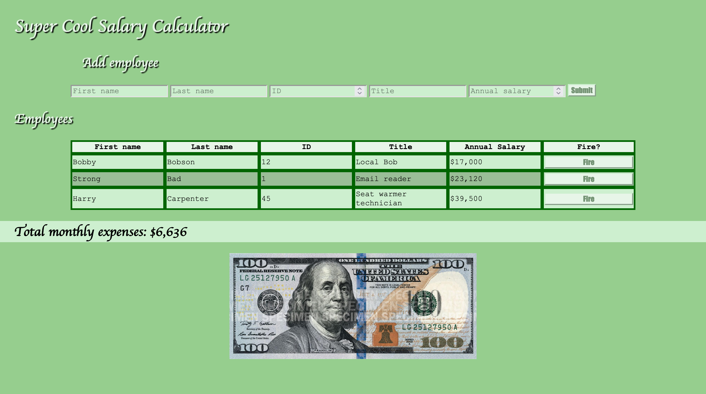

# Super Cool Salary Calculator

## Description

Duration: Over a weekend

A small web app that allows for savvy business owners to keep track of their employees, and to keep their pay roll
under budget. Made with a fairly sleek UI design, that is sure to keep your business afloat. Also includes a
'motivational' image on the bottom, so you will know when your business is on the right track, or you need to do some
trimming.

This program uses jQuery to modify the DOM on the site as the user adds and removes items.

## Usage

   1. Fill out all fields in the form properly.
   2. Press submit to add new employee.
   3. To remove an employee, click the fire button on their row.
   4. Profit!

## Built with:
jQuery
